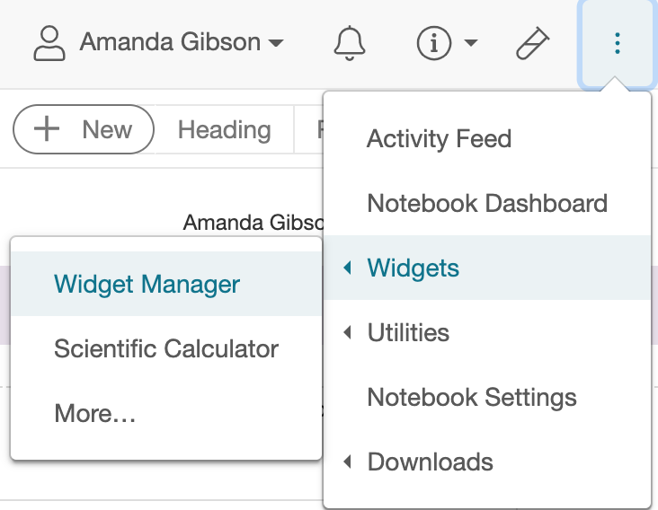
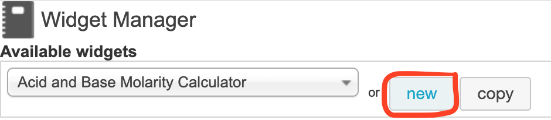
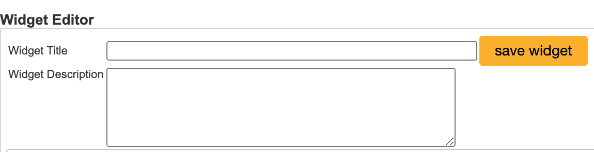
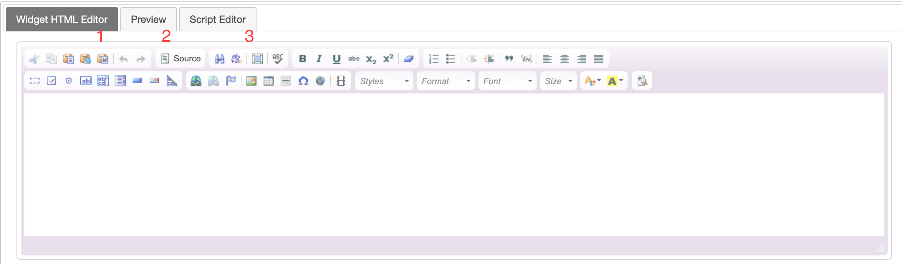
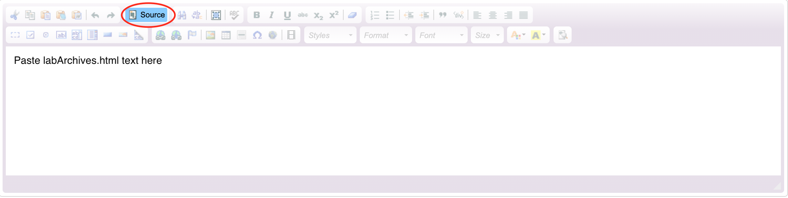
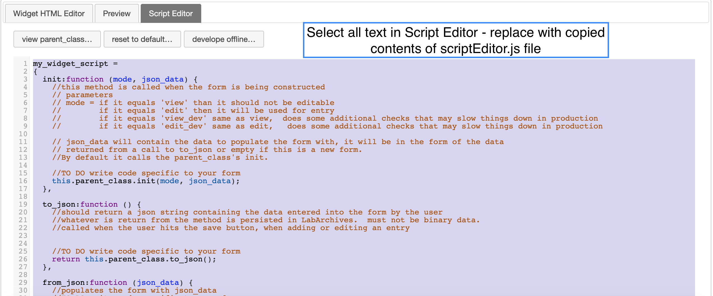
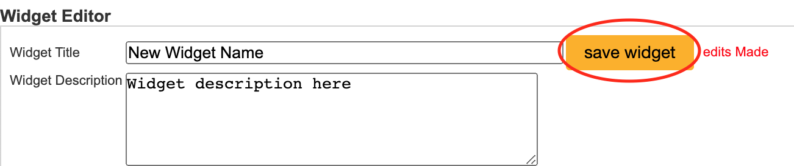
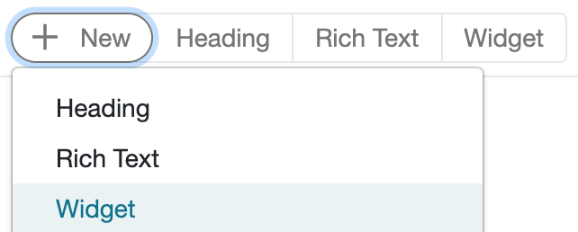
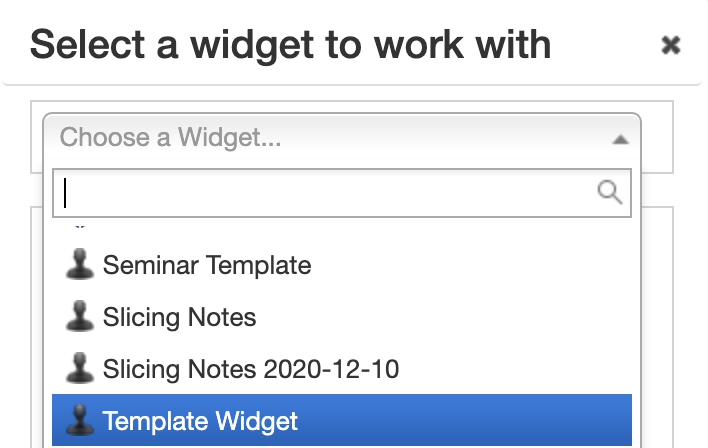
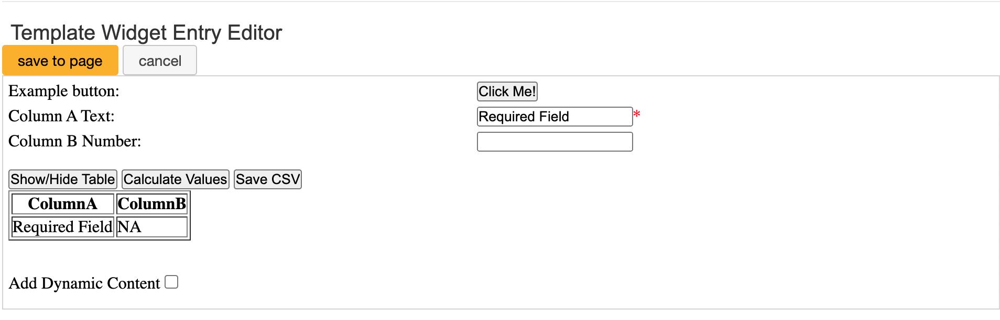

# LabArchivesWidgetTemplates
* Template files to create and design widgets for LabArchives electronic research notebooks.
* The instructions in this README will detail how to copy the contents of this repository to create new Widgets.
* These Widgets use HTML form elements and the JavaScript elements in LabArchives to create Widgets that can be added to LabArchives electronic research notebooks.

## Table of Contents
- [Navigate to Widget Manager](#navigate-to-widget-manager)
- [Create a New Widget](#create-a-new-widget)
- [Name Your Widget](#name-your-widget)
- [Edit the Content of the Widget](#edit-the-contents-of-the-widget)
  * [Widget HTML Editor](#widget-html-editor)
  * [Script Editor](#script-editor)
- [Save Your Widget](#save-your-widget)
- [Deploy Your Widget](#deploy-your-widget)
- [Edit or Develop Widgets](#edit-or-develop-widgets)

## Navigate to Widget Manager
Within LabArchives, click on the menu in the upper right-hand corner. Look for "Widgets" and then click on "Widget Manager"



## Create a New Widget
Click on "New" in the top bar of the Widget Manager



## Name Your Widget
Add a name and description to your Widget



## Edit the Contents of the Widget
You will see three different panes for developing your widget: (1) Widget HTML Editor (2) Preview and (3) Script Editor



### Widget HTML Editor
* Within the Widget HTML editor, press the "Source" button so that it turns blue
* Open the "labArchives.html" document for the widget you wish to add from this repository
  * [Template labArchives.html](templateWidget/labArchives.html)
  * Select all and copy the contents of this document
* Return to the Widget HTML editor. Paste the contents of labArchives.html
  * Source must be enabled to allow you to paste this content as HTML-formated text
  


### Script Editor
* Navigate to the Script Editor pane 
* Select all of the contents in this pane
* Open the "scriptEditor.js" document for the widget you wish to add from this repository
  * [Template scriptEditor.js](templateWidget/scriptEditor.js)
  * Select all and copy the contents of this document
* Return to the Script Editor. Paste the contents of scriptEditor.js, replacing the existing LabArchives default content



## Save Your Widget
Return to the top of the page within LabArchives. By the name and description, you will see a "Save" button and red text that indicates if edits have been made.



## Deploy Your Widget
* Navigate to the location in your notebook where you would like to add the widget
* Press "New" and look for "Widgets" within the list of content options
  * 
* Select the Widget you wish to add from the list
  * 
* Press "Use {Widget Name}"
  * 
* Edit the form contents, being sure to complete required fields before trying to save the Widget to the notebook
  * 

## Edit or Develop Widgets
* The "offlineDevelopment.html" file contains both the html form elements, script, and parent form elements provided by LabArchives.
  * [Template offlineDevelopment.html](templateWidget/offlineDevelopment.html)
  * This can be found for other widgets by clicking the "develope offline" button within the LabArchives Script Editor
* This file makes it easy to edit and develop widgets outside of the LabArchive environment using your prefered software. You can open then file in your browser of choice to view the appearance of the form
* Look for the following block of code within the offlineDevelopment.html file
```
//call to the init function in your script.  Note that you can change the mode in the call here.
//your choices are view,view_dev,edit,edit_dev,  see the parent class source for details
form_script.init("edit", function() {return form_script.test_data()});
```
* change "edit" to either "view" "view_dev" or "edit_dev" to test how the form appears in different contexts. For example, you can ensure that the appropriate buttons are disabled during view mode. 